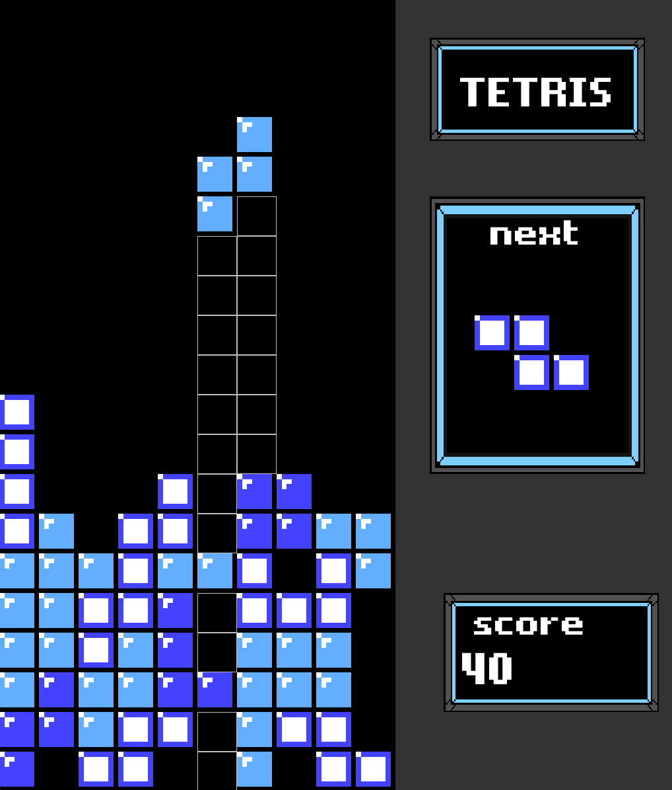

<h1>Tetris Game</h1>

  

This project is a Tetris game written in Python using the Pygame library. The game has a menu, sound effects and background music, and customizable graphics. The game includes a <code>settings.py</code> module to store game constants and a <code>tetromino.py</code> module to handle the creation and movement of Tetromino pieces.

<h2>Requirements</h2>
<ul>
  <li>Pygame library (<code>pip install pygame</code>)</li>
  <li>Python 3.x</li>
</ul>
<h2>Game controls</h2>

The following keys can be used to control the game:

<ul>
  <li><code>UP arrow</code> - rotate the Tetromino piece</li>
  <li><code>DOWN arrow</code> - move the Tetromino piece down faster</li>
  <li><code>LEFT arrow</code> - move the Tetromino piece to the left</li>
  <li><code>RIGHT arrow</code> - move the Tetromino piece to the right</li>
  <li><code>SPACE</code> - drop the Tetromino piece to the bottom</li>
</ul>
<h2>Customization</h2>

The game graphics can be customized by replacing the PNG files in the <code>sprites</code> directory with your own. The file names must be in the format <code>number.png</code> and there must be 10 files in total.

The background music and sound effects can be changed by replacing the MP3 and WAV files in the <code>music</code> and <code>sound</code> directories, respectively.

<h2>Conclusion</h2>

This Tetris game provides a fun and customizable gaming experience. Feel free to use this code as a starting point for your own projects or to learn more about game development using Pygame.

